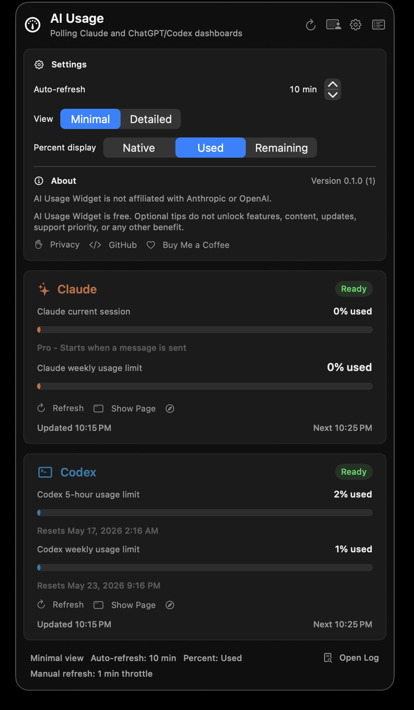
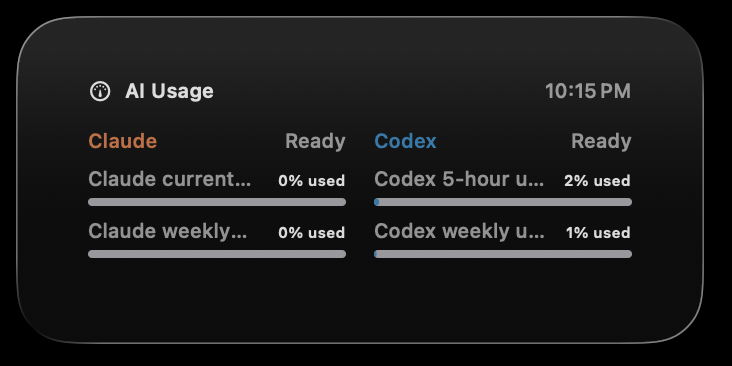

# AI Usage Widget

[](LICENSE)
[](https://github.com/peterwang998/codex-claude-usage-widget)
[](https://buymeacoffee.com/peterwang)

Small SwiftUI macOS menu-bar app for monitoring Claude and Codex usage limits from the real web dashboards:

- Claude: `https://claude.ai/settings/usage`
- Codex cloud analytics: `https://chatgpt.com/codex/cloud/settings/analytics`

It uses embedded WebKit pages, not local token estimates. Sign in once through each `Show Page` button; WebKit keeps those cookies for the app and later background polls reuse them.

## Screenshots

| Menu-bar app | Desktop widget |
| --- | --- |
|  |  |

## Features

- Menu-bar status view with minimal and detailed modes.
- Menu-bar-only app behavior; the app does not stay in the Dock while running.
- Floating app-owned desktop panel.
- WidgetKit extension for macOS Desktop widgets.
- Generated meter-style app icon.
- Claude current session and weekly usage limit display.
- Codex 5-hour and weekly usage limit display.
- Optional detailed rows from each provider's usage page.
- Configurable automatic refresh interval, clamped to 5-60 minutes.
- Percentage display normalization: native dashboard wording, percent used, or percent remaining.
- Conservative polling so dashboard pages are not refreshed aggressively.

## Install

Clone the repo first:

```sh
git clone https://github.com/peterwang998/codex-claude-usage-widget.git
cd codex-claude-usage-widget
```

### Full Install With Desktop Widget

Use this path if you want the app to appear in macOS Edit Widgets. It requires Xcode and a valid Apple Development signing identity.

Confirm that macOS can see your signing identity:

```sh
security find-identity -v -p codesigning
```

If the command lists an `Apple Development` identity, install the Xcode-built app with your Apple Developer Team ID:

```sh
DEVELOPMENT_TEAM=TEAMID ./scripts/install-xcode-app.sh
```

Replace `TEAMID` with your Apple Developer Team ID. The install script builds the Xcode project, signs the app and widget extension, replaces `/Applications/AI Usage Widget.app`, registers the WidgetKit extension, and launches the app.

By default, the script uses `TEAMID.ai-usage-widget` as the shared app group. You can also set it explicitly:

```sh
APP_GROUP_ID=TEAMID.ai-usage-widget \
DEVELOPMENT_TEAM=TEAMID \
./scripts/install-xcode-app.sh
```

The `TEAMID.` app group style is macOS-only and avoids needing a provisioning profile for the shared container. For a `group.`-prefixed App Group, register it in your Apple Developer account and make sure both the app and widget extension provisioning profiles include it.

### Quick Local Install

Use this path if you only need the menu-bar app and floating desktop panel. It does not require an Apple Developer certificate.

```sh
./scripts/install-app.sh
```

This direct install uses ad-hoc signing. The app can run locally, but the system Desktop widget may not appear in Edit Widgets on current macOS builds.

### After Installing

- Open AI Usage Widget from the menu bar.
- Use each provider's `Show Page` button to sign in to Claude and Codex once.
- Use `Refresh` after signing in, or wait for the next automatic poll.
- If Edit Widgets was already open, close and reopen it after installing the signed Xcode build.

The main app polls the web dashboards and writes a sanitized cache for the WidgetKit extension to render. The WidgetKit extension does not scrape webpages itself.

## Build

To build a local ad-hoc app bundle without installing it:

```sh
./scripts/build-app.sh
```

The app bundle is written to:

```text
build/AI Usage Widget.app
```

To build through Xcode without installing:

```sh
DEVELOPMENT_TEAM=TEAMID ./scripts/build-xcode-app.sh
```

To create a Release archive for App Store Connect after registering the production identifiers:

```sh
DEVELOPMENT_TEAM=TEAMID ./scripts/archive-app-store.sh
```

See `APP_STORE_SUBMISSION.md` for the full submission checklist.

To regenerate the app icon:

```sh
env CLANG_MODULE_CACHE_PATH="$PWD/.build-cache/clang" swift scripts/generate-app-icon.swift
```

## Settings

Open the gear button in the menu-bar window to change:

- View mode: minimal or detailed.
- Auto-refresh interval: 5-60 minutes, in 5-minute steps.
- Percent display: native, used, or remaining. This normalizes Claude and Codex when their dashboards use opposite wording.

## Refresh Policy

- Automatic polling: every 10 minutes per dashboard by default.
- Startup polling is staggered by 20 seconds so both dashboards are not hit at exactly the same time.
- Manual refresh is throttled to once per minute.
- Failed polls back off to 20 minutes.

This is intentionally conservative for dashboard pages whose underlying usage windows are measured in hours, not seconds.

## Notes

- A standalone WebKit app cannot safely import Chrome or Safari auth cookies. Use `Show Page` and sign in inside the widget once for each service.
- The dashboards are private, dynamic web apps. The parser reads rendered text, headings, and accessibility progress metadata. If either provider changes its page text, the card may show `Loaded, parser unsure`; use `Show Page` to inspect the current dashboard and adjust the parser keywords.
- The desktop button in the app opens an app-owned floating panel. The system Desktop widget is provided separately by the bundled WidgetKit extension.
- No API keys or OAuth secrets are stored by this app.
- Normal logs avoid raw dashboard text. Launch with `AI_USAGE_WIDGET_DEBUG_LOGS=1` only when debugging parser changes, because that mode can include rendered dashboard text in the local log file.

## Privacy And Tips

- The public privacy policy lives at `docs/privacy.md` and is intended for GitHub Pages at `https://peterwang998.github.io/codex-claude-usage-widget/privacy/`.
- The project landing page lives at `docs/index.md`.
- The in-app About section links to the privacy policy, GitHub repository, and Buy Me a Coffee.
- AI Usage Widget is free. Optional tips do not unlock features, content, updates, support priority, or any other benefit.
- App Review notes for the optional tip link are in `APP_REVIEW_NOTES.md`.

To hide the in-app Buy Me a Coffee link in direct script builds:

```sh
AI_USAGE_WIDGET_SHOW_TIP_LINK=0 ./scripts/build-app.sh
```

For Xcode script builds, use the same `AI_USAGE_WIDGET_SHOW_TIP_LINK=0` setting. In Xcode itself, override `AI_USAGE_WIDGET_TIP_LINK_SWIFT_FLAG` to an empty value.

## License

MIT
